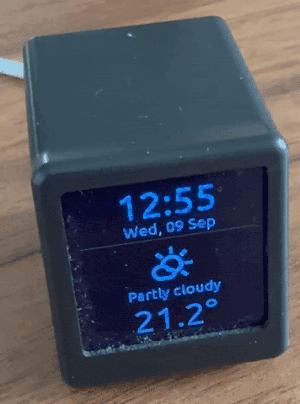

# GeekMagic SmallTV Ultra — Home Assistant Dashboard

[](https://github.com/zbuh/geekmagic-ultra-dashboard/actions/workflows/esphome-validate.yml)
[](LICENSE)

A fully generic, Home-Assistant-driven dashboard firmware for the [GeekMagic SmallTV Ultra](https://www.geekmagic.cc/) (ST7789V, 240×240), built on [ESPHome](https://esphome.io/). Point it at your own sensors once, then control everything else — rotation speed, which pages are shown, burn-in protection — live from Home Assistant, no reflashing required.

<p align="center">
  <br>
  <em>240×240 IPS panel · clock & weather · solar/energy dashboards · alarm status · lights status</em>
</p>

## Why this exists

The SmallTV Ultra is a cheap, cute little display, but out of the box it's stuck running the manufacturer's firmware. This project turns it into a small Home Assistant dashboard that rotates through a handful of pages — and, unlike a one-off personal config, it's built so you can fork it, point it at your own entities, and go, without having to understand ESPHome's C++ lambdas.

## Features

- 🕒 **Clock page** — time, date, and today's weather forecast (condition icon + description + temperature) from any HA `weather.` entity.
- 📊 **2 generic dashboard pages** — up to 4 entries each, arranged in a 2×2 grid. Each entry is an icon + a primary value + a secondary value, wired to any numeric HA sensor (or a fixed text label instead, your choice).
- 🔢 **Automatic unit scaling** — `W` → `kW`, `Wh` → `kWh` (and the `VA`/`var` equivalents) once a value crosses 1000, so a 4-digit wattage doesn't run out of room.
- 🚨 **Alarm page** — big status icon + name for any `alarm_control_panel` entity (Alarmo, HA's built-in Manual Alarm, etc.), dominated by the current state; a small footer shows the last transition (`Previous -> Current`, then `who@when`), and — best effort — what triggered it while armed.
- 💡 **Lights page** — big bulb icon, how many lights are on and which ones, or a clean "All lights off" when everything's off. Content is vertically centered instead of clinging to the top of the screen.
- 🌍 **Fully translatable** — every piece of on-screen text (weather descriptions, alarm state names, lights status) is a substitution, defaults to English, and can be swapped for your own language without touching any C++.
- 🛡️ **Burn-in protection** — the whole layout drifts a couple of pixels every minute, toggle it on/off from HA.
- 🎛️ **Configured live from Home Assistant** — rotation speed and which pages are active are normal HA entities on the device (a `number` and a handful of `switch`es). Change them from any dashboard, no reflash.
- 🪶 **ESP8266-friendly** — the whole thing (5 pages, ~15 live sensors, several fonts) compiles to about 40–55% RAM and ~40% flash on a stock ESP12E, logger disabled to keep every last byte for the display.

## Hardware

- GeekMagic **SmallTV Ultra** (ESP12E / ESP8266, ST7789V 240×240 SPI display)
- A Home Assistant instance the device can reach over WiFi/API

## Quick start

1. **Get the device into ESPHome.** In the ESPHome dashboard, create a new device with an *empty* configuration and compile it to get a minimal `.bin`. Flash that minimal build via the OTA option in the SmallTV's stock web UI — that's enough to get it talking ESPHome, after which you can push the real config over the air.
2. **Clone/copy this project**, then create your own `secrets.yaml` from the template:
   ```bash
   cp secrets.yaml.example secrets.yaml
   # edit secrets.yaml with your WiFi SSID/password
   ```
3. **Wire up your sensors.** Open `geekmagic-ultra-dashboard.yaml` and edit the `substitutions:` block at the top — that's the *only* part you need to touch. See [Configuration](#configuration) below.
4. **Compile & flash.** A project-local Python venv keeps this off your system Python:
   ```bash
   python3 -m venv .venv
   .venv/bin/pip install -r requirements.txt
   .venv/bin/esphome run geekmagic-ultra-dashboard.yaml
   ```
5. **Set the logger to `NONE` before your first real flash** if you change it while debugging — the display is RAM-hungry enough on an ESP8266 that the logger has to stay off in normal use.
6. From then on, day-to-day tweaks (rotation speed, which pages show, burn-in shift) happen from Home Assistant — no more reflashing.

## Configuration

Everything you need to personalize lives in the `substitutions:` block at the top of `geekmagic-ultra-dashboard.yaml`, organized in clearly commented sections. A change here needs a reflash; everything *outside* this block is generic and shouldn't need touching.

### Weather (main page)

| Substitution | What it is |
|---|---|
| `weather_entity_id` | Any HA `weather.*` entity. Its condition drives the icon + description, its `temperature` attribute drives the big number. |
| `weather_icon_*` (14) | One Material Symbols glyph per HA weather condition (`sunny`, `rainy`, `snowy`, ...). Leave any blank to skip that icon. |
| `weather_text_*` (14) | The description shown under the icon for each condition (defaults to English, e.g. "Rainy", "Thunderstorm"). Translate these to your own language. |

### The 2 generic pages

Each page has 4 entry slots (top-left, top-right, bottom-left, bottom-right), and each entry has 7 substitutions:

| Substitution | What it is |
|---|---|
| `pageN_entryM_icon` | A Material Symbols glyph. Leave empty to leave that slot blank (this is how a page ends up with fewer than 4 entries). |
| `pageN_entryM_primary_entity` / `..._secondary_entity` | Any numeric HA `sensor.*` entity. Use the placeholder `sensor.none` if you don't want a live sensor here. |
| `pageN_entryM_primary_unit` / `..._secondary_unit` | The sensor's unit (`W`, `kWh`, `%`, `°C`, `A`, ...) — used to auto-scale the display (see below). |
| `pageN_entryM_primary_label` / `..._secondary_label` | A fixed piece of text, used **instead of** the sensor when set (leave the matching `*_entity` as `sensor.none`). |

Feel free to reuse the same icon across multiple entries (e.g. the same "forecast" icon on 3 tiles) — each of the 8 slots gets its own dedicated font resource under the hood specifically so this doesn't collide.

### Alarm page

The page is built around the current state: a big icon + name, colored by state family (green disarmed, blue armed, amber pending, red triggered). Below a divider, a small footer shows either:
- while triggered: the best-effort cause (HA's raw `open_sensors` attribute), or
- otherwise: the last transition since the device booted — `Previous -> Current`, then `who@when` (e.g. `Nuno@09/09 14:32`). This is tracked on-device (the alarm entity itself doesn't expose its previous state), so it only appears once at least one real state change has happened since the last reboot/flash — nothing to show right after boot.

| Substitution | What it is |
|---|---|
| `alarm_entity_id` | Any `alarm_control_panel.*` entity (tested with [Alarmo](https://github.com/nielsfaber/alarmo), works with HA's built-in Manual Alarm too). |
| `alarm_icon_disarmed` / `_armed` / `_pending` / `_triggered` | Base icon for each state **family**. `_armed` is the default for every `armed_*` state, `_pending` for pending/arming/disarming. |
| `alarm_icon_armed_home` / `_armed_away` / `_armed_night` / `_armed_vacation` / `_armed_bypass` / `_arming` / `_disarming` | Per-exact-state overrides — each defaults to its family icon above, so you only need to touch one if you want a more granular look (e.g. a distinct icon for `armed_night` vs `armed_away`). |
| `alarm_text_disarmed` / `_armed_home` / `_armed_away` / `_armed_night` / `_armed_vacation` / `_armed_bypass` / `_pending` / `_arming` / `_disarming` / `_triggered` | The name shown for each state (defaults to English, e.g. "Armed Home", "TRIGGERED"). Translate these to your own language. |
| `alarm_text_cause_prefix` / `_cause_unknown` | Text around the best-effort trigger cause, e.g. `"Cause: "` / `"Unknown cause"`. |

### Lights page

| Substitution | What it is |
|---|---|
| `lights_entity_id` | A sensor whose **state** is the count of lights currently on and whose **`entity_name`** attribute is the list of their friendly names. A HA "Group" helper (light domain) + a small template sensor gets you this if you don't already have one. |
| `lights_icon_on` / `lights_icon_off` | Bulb icon shown when at least one light is on / when all are off. |
| `lights_text_all_off` | Shown when no lights are on (defaults to "All lights off"). |
| `lights_text_one_on` / `lights_text_on_suffix` | Headline for the "lights on" case: `lights_text_one_on` for exactly 1 (e.g. "1 light on"), otherwise built as `"<count> " + lights_text_on_suffix` (e.g. "3 lights on"). |

### Picking icons

Icons are pasted as raw glyph **characters**, not names — Material Symbols glyphs live in the Unicode Private Use Area, so they're invisible in most editors (that's normal, and why every icon substitution has a `# icon_name` comment next to it).

1. Go to [fonts.google.com/icons](https://fonts.google.com/icons), pick a Material Symbols icon in the **Outlined** style.
2. Copy the glyph character it gives you.
3. Paste it between the quotes of the matching substitution.

Every font in this project pulls its glyph set **automatically** from whichever icons you've pasted into the substitutions (`glyphs: "${page1_entry1_icon}${page1_entry2_icon}..."`) — you never need to touch the `font:` section yourself for the two generic pages, each of whose 8 icon slots gets its own dedicated font resource (so reusing an icon across entries, e.g. the same "forecast" icon on 3 tiles, just works). One caveat: ESPHome refuses to compile a font whose glyph list contains the same character twice. This can't happen on the generic pages (one glyph per font), but the alarm/lights "hero icon" font is shared and only lists the 4 base family glyphs — if you override one of the per-state `alarm_icon_*` substitutions (see above) to a genuinely *different* glyph rather than leaving it at its family default, add that glyph to `status_icon_font`'s `glyphs:` list too, or you'll hit a "duplicate glyph" build error.

## What's controllable live from Home Assistant

These show up as normal entities on the device once flashed — no reflash needed to change them:

| Entity | Type | What it does |
|---|---|---|
| Display Rotation Interval | `number` | Seconds each page stays on screen (3–60s) |
| Display Pixel Shift | `switch` | Burn-in protection on/off |
| Display Page Main | `switch` | Show/hide the clock & weather page |
| Display Page 1 / Display Page 2 | `switch` | Show/hide each generic page |
| Display Page Alarm | `switch` | Show/hide the alarm page |
| Display Page Lights | `switch` | Show/hide the lights page |
| SmallTV Display | `switch` | Backlight on/off |

Pages rotate in a fixed order (Main → Page 1 → Page 2 → Alarm → Lights → Main, ...), skipping any that are switched off.

## Project structure

```
geekmagic-ultra-dashboard.yaml    ESPHome config — substitutions, entities, page layouts, rotation logic
display_helpers.h         C++ helpers: unit formatting/scaling, the generic 2x2 grid renderer, alarm state mapping
secrets.yaml.example      Template for your WiFi credentials (copy to secrets.yaml, gitignored)
requirements.txt          Pinned ESPHome version for a reproducible local venv
```

## Local development

ESPHome is installed in a project-local virtual environment so it doesn't pollute your system Python:

```bash
python3 -m venv .venv
.venv/bin/pip install -r requirements.txt

.venv/bin/esphome config geekmagic-ultra-dashboard.yaml   # validate
.venv/bin/esphome compile geekmagic-ultra-dashboard.yaml  # compile, check RAM/flash usage
.venv/bin/esphome run geekmagic-ultra-dashboard.yaml       # compile + OTA upload + logs
```

## Notes & limitations

- ESPHome compiles statically — the device can't pick a new HA entity at runtime, only the *behavior* around already-wired entities (rotation, enable/disable, etc.) is live-configurable. Wiring a different sensor into a slot means editing a substitution and reflashing.
- Every entry field takes a real entity ID, even unused ones — leave them as the `sensor.none` placeholder rather than blank, since ESPHome requires a syntactically valid `domain.something` string.
- The "what triggered the alarm" text on the alarm page is best-effort: it shows HA's raw `open_sensors` attribute value as sent over the API, not a nicely formatted sensor name.
- The alarm page's "last transition" footer isn't persisted across a reboot/reflash — it's tracked in memory only, since the alarm entity itself doesn't expose its previous state. Everything else that's live-configurable from HA (which pages are enabled, rotation interval, pixel shift, backlight on/off) *does* survive a reboot.
- This was built and tuned against a specific home's Home Assistant setup — the example sensors wired into Page 1/Page 2 won't exist on your instance; swap them for your own.

## Disclaimer

Some of this is original work, some adapted from Home Assistant community forums, and a fair amount was generated with AI assistance. Use at your own risk — always double-check pin mappings and power ratings for your own hardware before flashing.
